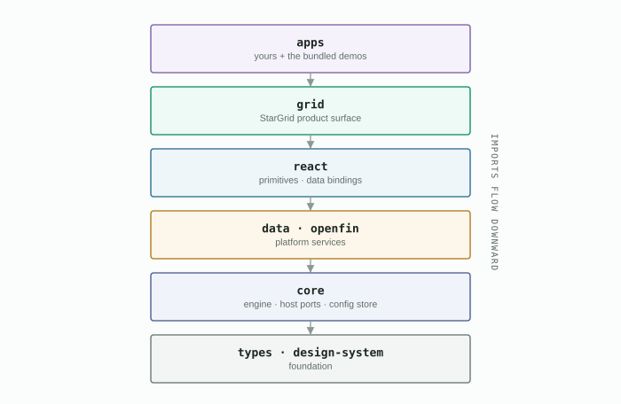

# StarUI platform

**StarUI** (MarketsUI) is a TypeScript library monorepo for building
trading-desk applications — data-dense grids, real-time market data,
multi-window OpenFin workspaces — on one coherent, token-driven design
system. It ships **seven npm packages**; the flagship surface is
**StarGrid** — one component for static data, live CSRM, and SSRM feeds,
with profile persistence, formatting, editing, and alerting built in.



**Documentation lives in [`docs/latest/`](./docs/latest/README.md)** —
[overview](./docs/latest/overview.md) ·
[getting started](./docs/latest/getting-started.md) ·
[architecture (with diagrams)](./docs/latest/architecture.md) ·
[package reference](./docs/latest/packages.md).

## Monorepo layout

```
stern-bak/                # @wellsfargo-starui/platform
├── packages/             # the seven library buckets — npm workspaces
├── apps/                 # demo/reference apps + Playwright e2e
│                         #   (own install root; outside the package CI surface)
├── scripts/              # build, packing, coverage, consumer glue
├── docs/                 # documentation — docs/latest/ is the current set
└── tools/                # repo-internal checks
```

## The seven packages

| Package | Role |
|---|---|
| `@wellsfargo-starui/types` | foundation contracts (depends on nothing) |
| `@wellsfargo-starui/design-system` | tokens, themes, icons; the AG-Grid theme adapter |
| `@wellsfargo-starui/core` | vanilla-TS runtime: grid engine, host ports, Dexie config store |
| `@wellsfargo-starui/data` | SharedWorker data services — one STOMP connection, every window |
| `@wellsfargo-starui/openfin` | OpenFin workspace shell + RuntimePort plugin (sole owner of `@openfin/core`) |
| `@wellsfargo-starui/react` | shadcn/Radix primitives, widget SDK, host wrapper, data bindings |
| `@wellsfargo-starui/grid` | **StarGrid** (root) over **MarketsGrid** (`/core`) + customizer + config browser + widgets |

Imports flow strictly downward — the full layer model, dependency graph and
runtime architecture are diagrammed in
[`docs/latest/architecture.md`](./docs/latest/architecture.md).

## Stack

- **Node** ≥ 20, **npm** 10 workspaces, **Turborepo** 2 — plain
  `npm install`, never `npm ci` (lockfiles are per-environment, not committed)
- **React** 19.2.x + **TypeScript** 5.9.x + **Vite** 7.x
- **AG Grid Enterprise** 35.1.x
- **OpenFin** 43.101.x (Core / Workspace)
- **Dexie** (IndexedDB) for config persistence; **SharedWorker** for live data
- **Radix UI** + shadcn primitives via `@wellsfargo-starui/react`
- **Vitest** 4 + **Playwright** 1.59

## Getting started

```bash
# packages only
npm install
npm run build            # turbo build + tsconfig.consumer.json
npm test                 # Vitest across packages/

# packages + demo apps, both consumption tracks (source AND tarball) — one command
npm run setup:apps
npm run app -- basic     # minimal StarGrid tutorial → :5194
```

`npm run setup:apps` builds the packages, packs them into tarballs, and
installs `apps/` (its own install root — see [Monorepo layout](#monorepo-layout))
for both tracks: `source/` (live against this checkout) and the generated
`tarball/` twins (an honest external-consumer install, vendored from the
packed tarballs). No `cd apps` and no separate tarball step required — see
[Running demo apps from the root](#running-demo-apps-from-the-root).

The demo apps double as reference implementations — each has its own README:
[`basic`](./apps/source/basic/) (start here),
[`markets-grid-lab`](./apps/source/markets-grid-lab/) (:5300),
[`design-system`](./apps/source/design-system/) (:5310),
[`dataprovider-editor`](./apps/source/dataprovider-editor/) (:5193),
[`star-demo`](./apps/source/star-demo/) (OpenFin, :5175),
[`stomp-marketsgrid-minimal`](./apps/source/stomp-marketsgrid-minimal/) (:5213),
[`stomp-view-server`](./apps/source/stomp-view-server/) (fixture broker, :8081).

## Running demo apps from the root

Set up both tracks once with `npm run setup:apps` (builds `packages/`, packs
tarballs, installs `apps/source/*` and generates + installs the `apps/tarball/*`
twins — see [Getting started](#getting-started)). Then `npm run app`
(`scripts/run-app.mjs`) runs any demo app — either track — without `cd`-ing
into `apps/`. It starts the STOMP broker automatically when the app needs one
and refuses to start if its port is already in use:

```bash
npm run app                                     # usage + app table
npm run app -- basic                            # source track, :5194
npm run app -- stomp-marketsgrid-minimal        # broker (stomp-view-server) starts automatically
npm run app -- star-demo --openfin              # dev server, then the OpenFin client
npm run app -- markets-grid-lab --tarball       # generated tarball twin, :6300
npm run app -- stomp-marketsgrid-minimal --no-broker   # skip the auto-started broker
```

| App | Source port | Tarball port | Notes |
|---|---|---|---|
| `basic` | 5194 | 6194 | |
| `dataprovider-editor` | 5193 | 6193 | |
| `design-system` | 5310 | 6310 | |
| `markets-grid-lab` | 5300 | 6300 | |
| `star-demo` | 5175 | 6175 | starts the broker unless `--no-broker`; supports `--openfin` |
| `stomp-marketsgrid-minimal` | 5213 | 6213 | requires the broker |
| `stomp-view-server` | 8081 | — | the broker itself; source-track only (imports no `@wellsfargo-starui` packages, so no tarball twin) |

`--tarball` targets the generated twin at `apps/tarball/<app>` on its own port
(source port **+ 1000**), so both tracks can run at once. `Ctrl+C` tears down
everything the command started, including any broker it launched. Details on
the two consumption tracks, and how to refresh the tarball track after a
`packages/` change, are in [`apps/README.md`](./apps/README.md#refreshing-the-tarball-track-after-a-packages-change)
and [`docs/APPS_REPO.md`](./docs/APPS_REPO.md).

## Scripts

| Script | What it does |
|---|---|
| `npm run setup:apps` | one-shot: build packages, pack tarballs, install `apps/` — both the `source/` and generated `tarball/` tracks |
| `npm run app -- <name>` | run any demo app from the root — auto-starts the STOMP broker when the app needs it; `--tarball` for the generated twin, `--openfin` for the star-demo launcher |
| `npm run build` | turbo build across the seven packages + regenerate `tsconfig.consumer.json` |
| `npm run typecheck` | build, then turbo typecheck |
| `npm test` | turbo Vitest across `packages/` |
| `npm run test:coverage` | instrumented run; merges per-bucket LCOV → `coverage/lcov.info` (Sonar) |
| `npm run check:coverage` | the **70%-per-file** gate (lines, statements, functions, branches) |
| `npm run lint:all` | ESLint + dependency cycles + design-system dep rules + RTL enforcement |
| `npm run check:ds-tokens` | no-hardcoded-hex token policy scan |
| `npm run pack:npm` | pack each package as a real npm tarball → `dist-npm/` |
| `npm run verify:external` | prove the tarballs install with `packages/` hidden |
| `npm run clean` | remove node_modules / dist / turbo caches |

## Shipping to consumers

`npm run pack:npm` emits one tarball per package under `dist-npm/`
(gitignored), each under its real name — consumers install and import with no
aliases and no build glue. The bundled apps consume the same packages two
ways (live source and vendored tarballs) so external consumption can never
silently break; the full story is in
[`docs/latest/architecture.md § build & consumption`](./docs/latest/architecture.md#6-build--consumption-tracks)
and [`docs/APPS_REPO.md`](./docs/APPS_REPO.md).

## Testing

- **Unit** — Vitest 4 + jsdom across `packages/`; React components are tested
  with React Testing Library (enforced by `npm run check:rtl`).
- **Coverage** — 70% per file on all four metrics with `all: true`, so an
  untested file fails at 0%. See
  [`docs/COVERAGE_PLAN.md`](./docs/COVERAGE_PLAN.md).
- **E2E** — Playwright under [`apps/e2e`](./apps/e2e)
  (`cd apps && npx playwright test`); drives the demo apps. Nothing under
  `packages/` runs e2e.

## Key docs

| Doc | Contents |
|---|---|
| [`docs/latest/`](./docs/latest/README.md) | **the current documentation set** — overview, getting started, architecture, package reference |
| [`docs/current-features.md`](./docs/current-features.md) | granular inventory of every shipped feature |
| [`docs/APPS_REPO.md`](./docs/APPS_REPO.md) | the `apps/` tree: two consumption tracks, platform linking |
| [`docs/WORKLOG.md`](./docs/WORKLOG.md) | known-open items — check before starting work |
| [`docs/guides/`](./docs/guides/) | focused how-tos (platform bootstrap config, design-system upgrade + OpenFin palette bridge) |

## Copyright

Internal Wells Fargo Capital Markets project. Not open-source.
