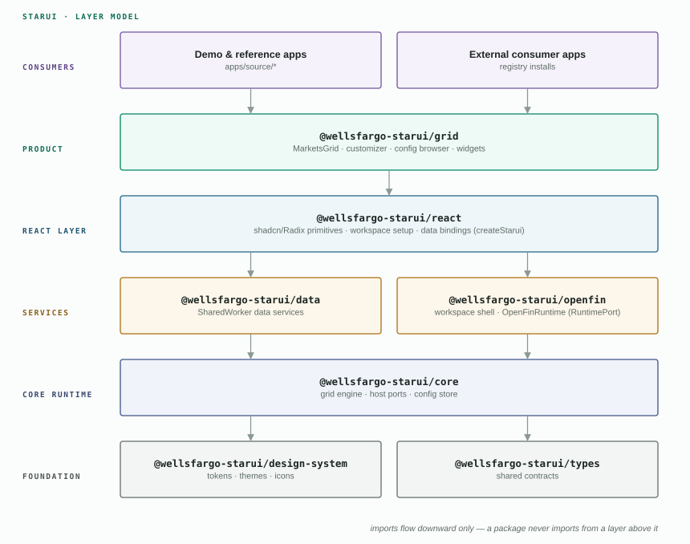
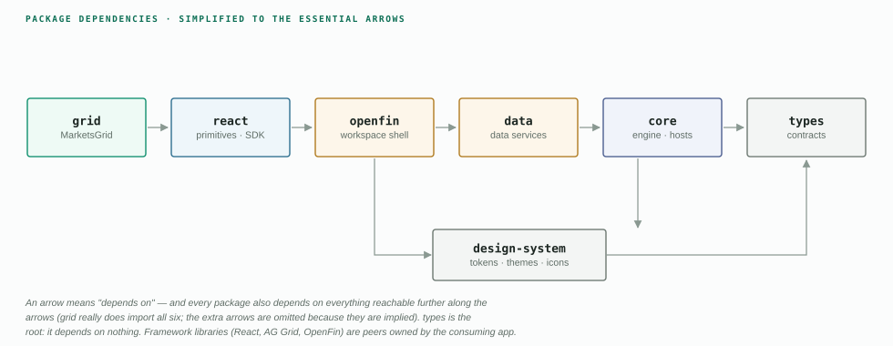
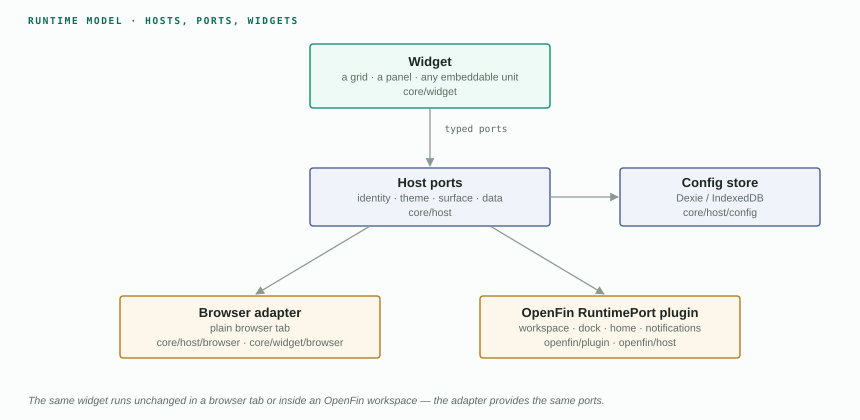
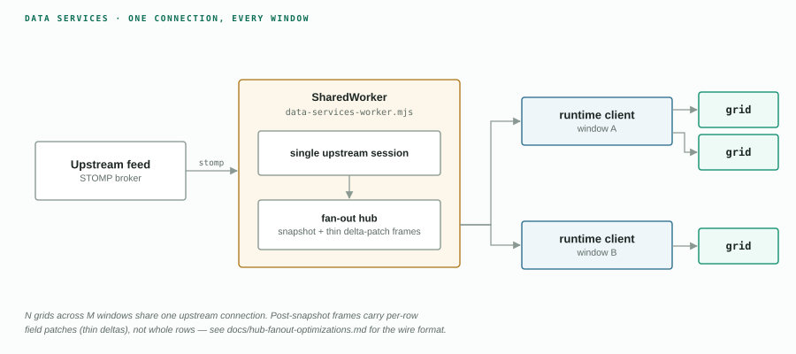
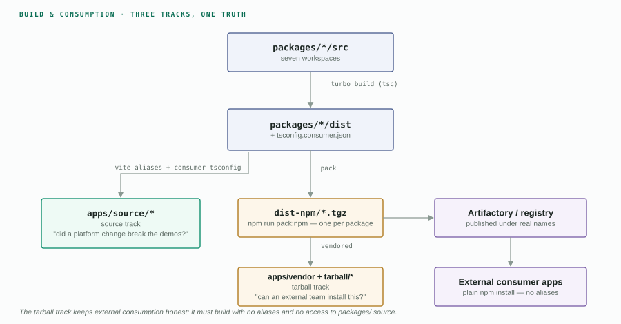

# StarUI Architecture

StarUI (the MarketsUI platform) is a layered TypeScript monorepo that ships
**seven npm packages** — a design system, a vanilla-TS core runtime, data
services, an OpenFin workspace shell, a React component layer, a foundation
types package, and the flagship **MarketsGrid** product surface. Consumer
applications sit on top and are never imported by the packages.

This document is the canonical architecture reference. For per-package export
details see [packages.md](./packages.md); for hands-on setup see
[getting-started.md](./getting-started.md).

---

## 1. Layer model

Packages are organized into strict layers. **Imports only flow downward** —
a package may import from its own layer or below, never above.



### Import boundary rules

| Rule | Enforced by |
|---|---|
| Foundation packages (`types`, `design-system`) import **nothing** except each other | convention + review |
| `core` never imports framework adapters (`grid`, `react`) | convention + review |
| Only `openfin` may import `@openfin/core` | `eslint.config.mjs` boundary rules |
| Apps import packages — **never** the reverse | package layering (apps are not workspaces) |
| No package imports from `apps/` | `apps/` sits outside the workspace graph |

---

## 2. Package dependency graph

The real `dependencies` edges between the seven packages (framework libraries
such as React, AG Grid and OpenFin are peer dependencies, deliberately owned
by the consuming application):



`types` is the root of the graph — it depends on nothing. `grid` is the leaf —
it composes everything below into the product surface.

### Framework peers (owned by the app)

| Peer | Required by |
|---|---|
| `react`, `react-dom` | `grid`, `react`, `design-system` |
| `ag-grid-community` / `ag-grid-enterprise` / `ag-grid-react` | `grid` (community peer also on `core`, `design-system`) |
| `@openfin/core`, `@openfin/workspace`, `@openfin/workspace-platform` | `openfin` only |
| `@tanstack/react-query` | `grid`, `react` |
| `tailwindcss` | `react`, `design-system` |

---

## 3. Monorepo layout

```
stern-bak/                          # @wellsfargo-starui/platform
├── packages/                       # the seven buckets — npm workspaces
│   ├── types/                      #   @wellsfargo-starui/types
│   ├── design-system/              #   @wellsfargo-starui/design-system
│   ├── core/                       #   @wellsfargo-starui/core
│   ├── data/                       #   @wellsfargo-starui/data
│   │   └── host-data-angular/      #   (excluded from the pipeline)
│   ├── openfin/                    #   @wellsfargo-starui/openfin
│   ├── react-core/                 #   @wellsfargo-starui/react
│   └── react-grid/                 #   @wellsfargo-starui/grid
├── apps/                           # demo apps + e2e — own install root,
│   ├── source/                     #   outside workspaces/turbo/coverage
│   ├── tarball/                    #   generated twins (gitignored)
│   ├── vendor/                     #   vendored tarballs (gitignored)
│   ├── e2e/  e2e-openfin/          #   Playwright suites
│   └── scripts/
├── scripts/                        # build, packing, coverage, consumer glue
├── docs/                           # documentation (latest/ = current set)
└── tools/                          # repo-internal checks
```

The build is **Turborepo 2** over npm 10 workspaces; every package builds with
`rimraf dist && tsc`. `npm run build` also regenerates
`tsconfig.consumer.json` — the generated `paths` map that lets any consumer
typecheck against the repo without being inside it.

---

## 4. Runtime architecture — hosts, ports and widgets

The core runtime is framework-agnostic vanilla TypeScript. A **host** provides
platform capabilities to **widgets** through typed **ports**; adapters plug the
same contracts into different environments.



- **`types`** defines the port contracts (identity, theme, surface) and shared
  widget-framework types, so every layer agrees on the same shapes.
- **`core/host/config`** persists configuration through a Dexie (IndexedDB)
  store; profiles and grid state ride the same mechanism.
- The **browser adapter** runs everything in a plain browser tab; the
  **OpenFin plugin** provides the same ports inside an OpenFin workspace —
  widgets don't change between the two.

---

## 5. Data services

`@wellsfargo-starui/data` centralizes market-data distribution in a
**SharedWorker**, so N grids across M windows share one upstream connection.



Key properties:

- **One connection, many consumers** — the worker owns the STOMP session;
  windows attach through `data/runtime/client`.
- **Thin deltas** — post-snapshot live frames broadcast per-row field patches
  rather than whole rows (see
  [hub-fanout-optimizations](../hub-fanout-optimizations.md) for the wire
  format and measured wins).
- **Build-generated asset** — the worker bundle ships as
  `data/assets/data-services-worker.mjs` and is emitted by `npm run build`;
  the shared Vite config self-heals it if missing.

---

## 6. Build & consumption tracks

The same packages are consumed three ways. The **tarball track exists to keep
external consumption honest** — it must work with no aliases and no access to
the repo's source tree.



| Track | Resolution | Question it answers |
|---|---|---|
| **source** | Vite aliases + generated `tsconfig.consumer.json` | did a platform change break the demos? |
| **tarball** | plain `node_modules` from vendored tarballs | can an external team install this? |
| **external** | registry install, real package names | production consumption |

Details and the exact commands live in
[getting-started.md](./getting-started.md) and
[APPS_REPO.md](../APPS_REPO.md).

---

## 7. Quality gates

| Gate | Command | Scope |
|---|---|---|
| Typecheck | `npm run typecheck` | all seven packages |
| Unit tests | `npm test` | Vitest 4 + jsdom across `packages/` |
| Coverage | `npm run test:coverage` + `npm run check:coverage` | **70% per file** on lines, statements, functions, branches — `all: true`, so untested files count |
| Lint + boundaries | `npm run lint:all` | ESLint, dependency cycles, design-system token rules, RTL enforcement |
| External-consumer proof | `npm run verify:external` | installs the packed tarballs with `packages/` hidden |
| E2E | Playwright under `apps/e2e` | drives the demo apps |

`apps/` is deliberately **outside** every package gate: it is its own npm
install root, excluded from workspaces, Turbo, lint, coverage and Sonar —
demo apps never dilute the platform's coverage bar.
